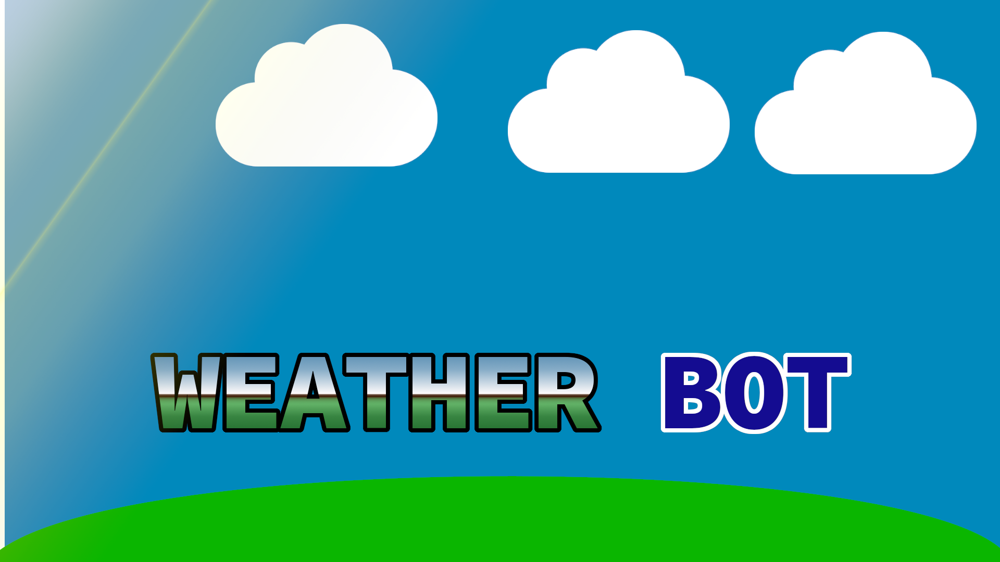
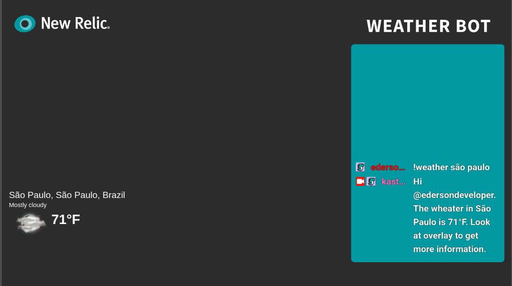

# Weather Bot



Weather Bot is a Twitch bot to know about weather of cities using chat commands, like `!weather` and your city, to show the weather in the screen.

# Description

The application is a chatbot for a twitch that aims to interact the chat with the bot to display climate information for a particular city in the world. The application was built using nodejs on the backend and HTML5, CSS3, Javascript, and WebSocket on the front end.

The bot uses a [Mapbox](https://docs.mapbox.com/api/overview/) API to search for the coordinates of a city informed by the user and also uses an [AccuWeather](https://developer.accuweather.com/apis) API to get the city's climate information informed. With the data of these APIs, it is reserved for viewers as climatic information in the broadcast chat and also in the broadcast overlay.

During a stream on the twitch there can be dozens, hundreds or even levels of people interacting with the bot, and, consequently, the bot can suffer from performance problems.

In this way, a new relic platform has been integrated into the bot to monitor its performance. The new relic platform makes it possible to create a panel that allows viewing the number of requests per second that the bot receives, the total processing time for each request and the time spent for each external API call, and also the time spent for displaying the requests. chat information and without the overlay.

# Used technologies

This project uses New Relic to monitore the application, with the time of each request, and performance data.

This project uses too NodeJS for Backend, and Javascript, CSS, HTML, And Socket.io for Frontend.

Was used [Mapbox](https://docs.mapbox.com/api/overview/) to get the coordinates of city only with the name. And [AccuWeather](https://developer.accuweather.com/apis) to get the wather with the coordinates of the city.

# Installing and running locally

Clone the project, and create a file named `.env`, with some credentials, being:

```
BOT_NAME= Name of your Twitch bot
CHANNEL_NAME= Name of your Twitch channel
TOKEN= Your Twitch Token

MAPBOX_TOKEN= Your Mapbox Token
WEATHER_TOKEN= Your Accuweather Token

UNIT= Your temperature unit, like F (Fahrenheit) or C (Celsius)
LANGUAGE_WEATHER= The language of Weather, like en or pt
```

After this, create a project in [New Relic](https://one.newrelic.com/) get the file `newrelic.js`, and put in the same folder of `index.js`, and WeatherBot will be connected to New Relic.

Now, you need to run `npm install` to install all dependencies, and `npm start` to start the bot. After starting the bot, acess `http://localhost:3000` in your OBS (Using a OBS Browser Overlay), and the data will be shown on the screen.

And if you go to the twitch chat and type `!weather <city_name> `. The information will show in your overlay.


